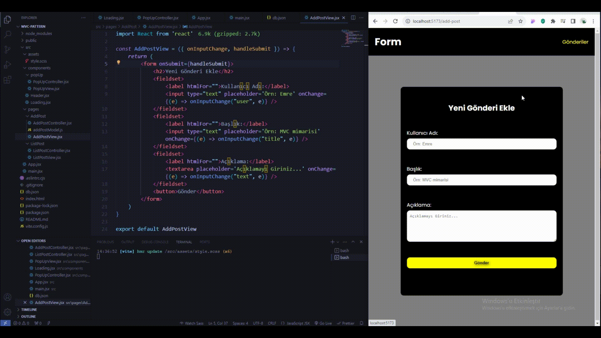

# kütüphaneler

- react-router-dom
- json-server
- axios
- sass

# MVC

- Model: Uygulamanın veri veya veri yapısını temsil eder.
- örn: Projede tutulan statelerin bir obje veya form şeklinde olmasını sağlar

- View: Kullanıcı arayüzünü temsil eder
- örn: JSX kodları bu dosya içerisinde yazılır (div, form...)

- Controller: Model ve View arasındaki iletişimi kurar.
- örn: kullanıcı etkileşiminde çalışacak fonksiyon api istekleri burada yazılır

# Yapılacaklar

- Apı üzerinden blog verilerini al ("Controller")
- her bir blog için ekrana card bas ("View")

- form arayüzü oluştur `View`
- formdaki inputlar her değiştiğinde statelerini tut `Controller`
- state üzerinde tutulacak değerleri belirle `Model`
- gönder butonuna tıklanınca postu apiye gönder ve kullanıcıyı yönlendir `Controller`

